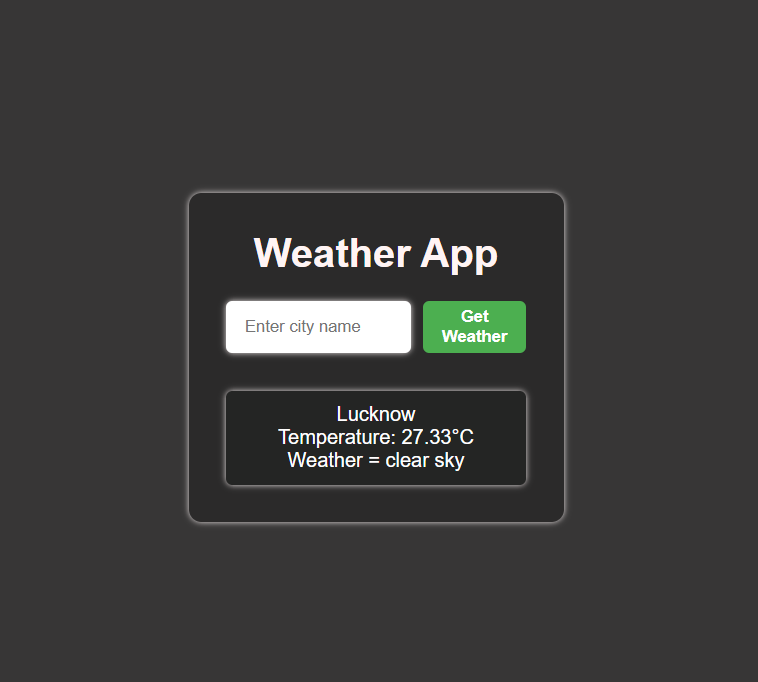

# Weather App 🌦️

This is a simple **Weather App** that allows users to enter a city name and retrieve real-time weather data using the OpenWeather API.  

## Features 🚀
- Search for weather by city name  
- Displays temperature, weather conditions, and city name  
- User-friendly interface with a sleek design  
- Error handling for invalid city names  

## Demo 📸
  


## Technologies Used 🛠️
- **HTML** - Structure of the webpage  
- **CSS** - Styling and layout  
- **JavaScript** - Fetching and displaying weather data using OpenWeather API  

## Installation & Usage 📥
1. Clone this repository:  
   ```sh
   git clone https://github.com/YOUR_GITHUB_USERNAME/weather-project.git
   ```
2. Open the `index.html` file in a browser.  
3. Enter a city name and click **Get Weather** to fetch weather details.  

## API Setup ⚙️
1. Sign up at [OpenWeather](https://openweathermap.org/api) to get a free API key.  
2. Replace `USE_YOUR_API_KEY` in `script.js` with your actual API key:  
   ```js
   const API_KEY = "YOUR_ACTUAL_API_KEY";
   ```

## Project Structure 📂
```
/weather-project
│── index.html      # Main HTML file
│── style.css       # Stylesheet for the app
│── script.js       # JavaScript logic
│── README.md       # Documentation
```

💙 Made with passion by **Satvic Bajpai**
